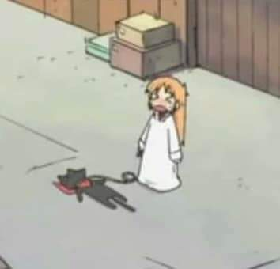
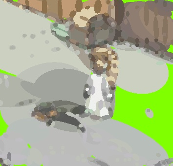

# shitize

a bad rework of [Tw1ddle/geometrize](https://github.com/Tw1ddle/geometrize)

把图片变成圆圆圆圆圆圆圆圆

シテゼ

## usage
```
python main.py [image path]
```

## example

Color quantize series: 50

Filter core size: 5

Total shapes: 577



